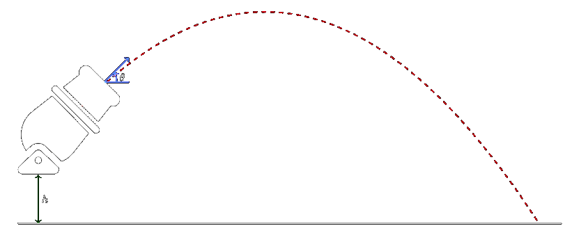
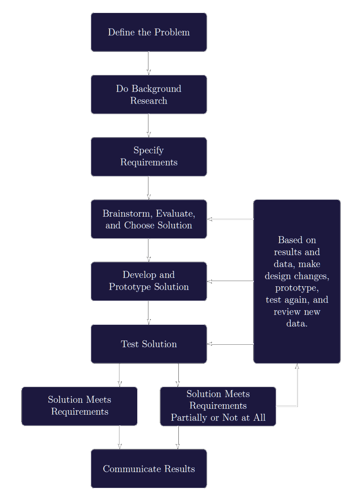

# Table of Contents

1.  [Howitzer Firing Simulator](#orgc97bcf4)
    1.  [Rigid Body Kinematics and Dynamics](#org9416813)
    2.  [Design](#orgb28ec05)
    3.  [Requirements](#orgcea8ea5)
        1.  [Presentation](#org18fe968)

# Howitzer Firing Simulator

A Howitzer company is asking for a simulator to teach the soldiers about kinematics and dynamics. They would like to simulate the howitzer shooting a projectile across an empty field (Figure 1).

Some possible variables to the simulator are the barrel pose (position and orientation), radius and mass of the projectile, drag coefficient, initial speed, force applied to the projectile, and gravity.

## Rigid Body Kinematics and Dynamics

The rigid body kinematics and dynamics of any object expressed in an inertial frame are

$$p(t) = v(t)$$

$$m\dot{v}(t) = f(t) + f_{d}(t) + mg$$

Where, $p \in \mathbb{R}^{3}$ is the position of the projectile, $v \in \mathbb{R}^{3}$ is the linear velocity of the projectile, $m \in \mathbb{R}^{3}$ is the mass of the projectile, $g \in \mathbb{R}^{3}$ is the acceleration due to gravity, $f \in \mathbb{R}^{3}$ is the external force acting on the object, and $f_{d} \in \mathbb{R}^{n}$ is the drag force acting on the object.

In fluid dynamics, the drag force is:

$$f_{d} = -\frac{1}{2} CpAu(t)^{2} $$

Where, $C \in \mathbb{R}^{}$ is the drag coefficient, $\rho \in \mathbb{R}^{}$ is the density of the fluid, $A \in \mathbb{R}^{}$ is the area of the projectile facing the fluid, and $u \in \mathbb{R}^{}$ is the flow velocity relative to the projectile.

## Design

You need to go through the structured design process (Figure 2) while considering different factors that can impact the final position of the projectile.

## Requirements

The projects objective is not to implement a complete working simulator but to design test suites for one.

-   Write the simulator using Java programming language. Use any IDE of your choice
-   Use GitHub for source code management
-   Choose any function from the simulator and test it with
    -   Boundary value testing
    -   Equivalence class testing
    -   Decision table-based testing
    -   Path testing
    -   Dataflow
    -   Slice testing
-   Choose a subset of units to perform Integration testing
-   Choose a subset of use cases to perform System testing

A separate written report is NOT required, but the entire GitHub project should be ‘self-documenting’

### Presentation

-   The project should include a READEME.md file that describes the simulator (not the testing), installation instructions (if necessary), and use instructions.
-   The project should include a TESTING.md that describes the test plan. It should include any necessary information to understand the test cases. For example, in equivalence class testing it should state what the equivalence classes are and for system testing it should contain the use cases being tested. This should not be a long document, but should contain a minimum information about all the technical requirements.
-   All the code should be well commented.

