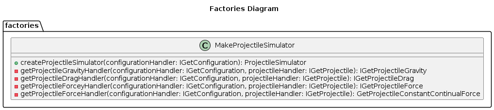

# Table of Contents

1.  [Design Choices](#org5ab0ffc)
    1.  [Benefits](#org2fb050e)
    2.  [Basic Classes](#orgdf102ae)
        1.  [Interfaces](#org505796c)
        2.  [Handler Stubs](#orgc7119c1)
        3.  [Handlers](#org41e51f2)
        4.  [Factories](#orgf42c553)
        5.  [Projectile](#org8fe4830)
        6.  [Enums](#orgb5e33d7)
        7.  [Simulator](#org4d983f6)
        8.  [Simulation Suite](#orga29c91f)
2.  [Overall Class Diagram](#org4a6dbf0)

# Design Choices

Taking into account the modularity, extensibility, and testability required for this simulation program, the strategy design pattern is best suited.

The strategy design pattern allows us to select an algorithm&rsquo;s behavior at runtime. It defines a family of algorithms, encapsulates each one, and makes them interchangeable. In this case, there are multiple methods (strategies) for simulating the physics of a projectile, accounting for different factors such as wind resistance, gravity, barrel pose, etc. These strategies could then be hot swapped at runtime.

This allows for adding new - or removing, variables without affecting the overall structure of the simulation, and without having to change the main simulation code. This separation of concerns makes it easier to write tests for each strategy.

## Benefits

-   *Flexibility*: It allows us to dynamically choose between different behaviors.

-   *Extensibility*: We can add new behaviors without affecting existing code.

-   *Testability*: We can test behaviors individually, isolated from the rest of the system.

## Basic Classes

The individual Classes and basic relationships are as follows:

### Interfaces

### Handler Stubs

### Handlers

### Factories

### Projectile

### Enums

### Simulator

### Simulation Suite

# Overall Class Diagram

For readability, stub classes and settings enums are not included in this diagram, refer to diagrams above for details.

